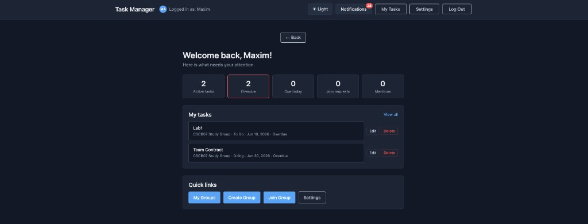
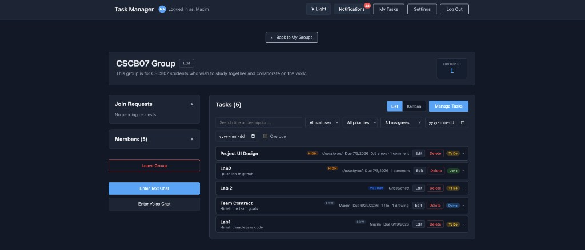
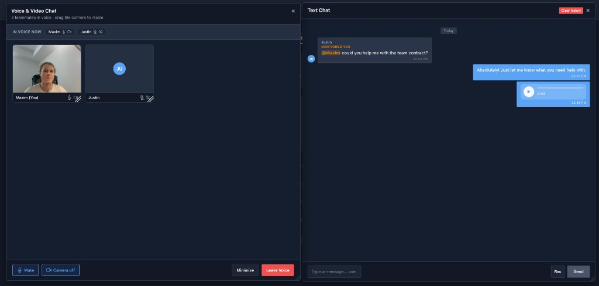

# Collaborative Task Manager

A full-stack collaboration platform combining shared task management, real-time messaging, and WebRTC voice/video calls within a single team workspace.

**Live demo:** [collaborative-task-manager-kohl-seven.vercel.app](https://collaborative-task-manager-kohl-seven.vercel.app/)







## Overview

Collaborative Task Manager lets users sign up, create or join groups, and work together inside a shared workspace. Each group has its own task board, filters, chat, and voice/video room. A personal dashboard keeps track of what is assigned to you, what is overdue, pending join requests, and unread mentions.

The app is designed for small teams, study groups, or friends who want one place to plan work and talk without switching between a todo app and a chat app.

## Local setup

### Required software

- **Node.js** 18+ and **npm**
- **PostgreSQL** 14+

### Backend

From the project root:

```bash
npm install
cp .env.example .env
# Edit .env with your database URL, JWT secret, and TURN credentials
createdb collaborative_task_manager   # skip if the database already exists
npm run setup-db
npm run dev
```

The API runs at `http://localhost:3000`.

### Frontend

In a second terminal:

```bash
cd frontend
npm install
cp .env.example .env
# Leave VITE_BACKEND_URL empty for local dev (Vite proxies /api and /socket.io)
npm run dev
```

The app opens at `http://localhost:3001`.

### Environment variables

**Root `.env`** (backend) — see `[.env.example](.env.example)`:


| Variable                                                  | Required   | Description                                       |
| --------------------------------------------------------- | ---------- | ------------------------------------------------- |
| `DATABASE_URL`                                            | Yes*       | PostgreSQL connection string                      |
| `DB_USER`, `DB_PASSWORD`, `DB_HOST`, `DB_PORT`, `DB_NAME` | Yes*       | Alternative to `DATABASE_URL`                     |
| `JWT_SECRET`                                              | Yes        | Secret for signing auth tokens                    |
| `JWT_EXPIRES_IN`                                          | No         | Token lifetime (default: `7d`)                    |
| `NODE_ENV`                                                | No         | `development` or `production`                     |
| `PORT`                                                    | No         | API port (default: `3000`)                        |
| `FRONTEND_URL`                                            | Production | Comma-separated allowed frontend origins for CORS |
| `TURN_URL`                                                | Yes**      | STUN/TURN servers for WebRTC                      |
| `TURN_USERNAME`                                           | Yes**      | TURN username                                     |
| `TURN_CREDENTIAL`                                         | Yes**      | TURN password                                     |
| `ICE_TRANSPORT_POLICY`                                    | No         | Set to `relay` to force TURN-only testing         |


 Provide either `DATABASE_URL` or the individual `DB_`* variables.

* Required for reliable voice/video across different networks. Free relay credentials are included in `.env.example`.

**Frontend `.env*`* — see `[frontend/.env.example](frontend/.env.example)`:


| Variable           | Required        | Description                                                     |
| ------------------ | --------------- | --------------------------------------------------------------- |
| `VITE_BACKEND_URL` | Production only | Backend URL on Vercel (no trailing slash). Leave empty locally. |


## Tech Stack

### Frontend

- **React** with **Vite**
- **JavaScript**
- **HTML** and **CSS** (CSS Modules)
- **React Router** for navigation
- **Axios** for REST API calls
- **Socket.io client** for real-time updates

### Backend

- **Node.js** with **Express**
- **PostgreSQL** via the `pg` driver
- **Socket.io** for live chat, typing indicators, task updates, and WebRTC signaling
- **JWT** authentication
- **bcrypt** for password hashing
- **Multer** for file uploads (attachments, avatars, voice messages, drawings)

### Real-time and media

- **WebRTC** for group voice and video chat
- **STUN/TURN** (Metered Open Relay) for connections across different networks

### Deployment

- **Vercel** (frontend)
- **Render** (backend)
- **Supabase** (PostgreSQL)

## Features

### Accounts and groups

- Sign up and log in with username, email, and password
- Create groups with a name and description
- Join existing groups by group ID
- Three join modes:
  - **Public**: anyone can join instantly
  - **Private (password)**: members need the group password
  - **Request to join**: the owner approves or declines join requests
- Browse and manage your groups from **My Groups**

### Dashboard

Your home base after logging in. The dashboard shows:

- Summary counts for active tasks, overdue tasks, tasks due today, pending join requests, and unread mentions
- A list of tasks assigned to you across all groups
- Pending join requests waiting for your approval (if you own groups)
- Unread @mentions from group chat
- Quick edit and delete actions on your tasks

### My Tasks

A cross-group view of everything assigned to you, with search and filters for status, priority, due date range, and overdue items.

### Group workspace

Each group is a full collaboration space with tasks, chat, and voice/video.

#### Tasks

- Create, edit, and delete tasks
- Assign tasks to group members
- Set due dates and priority levels (Low, Medium, High, Urgent)
- Track status: **To Do**, **Doing**, **Done**
- Switch between **list view** and **kanban board**
- Filter and search by title, status, priority, assignee, due dates, and overdue tasks
- **Subtasks** on each task with their own completion state
- **Comments** on tasks with **@mentions** that notify tagged users
- **Attachments** (PDFs, images, and other supported file types)
- **Drawing tool** to sketch ideas directly on a task and save them to the task
- **Activity log** showing what changed on a task over time

#### Text chat

- Real-time group messaging
- **@mentions** in chat with notifications
- Typing indicators
- **Voice messages**: record and send audio clips in the chat thread

#### Voice and video chat

- Join a live voice room inside any group
- Toggle microphone mute and camera on/off
- See who is in the call with a participant roster
- Works across devices and networks using WebRTC with TURN relay support

### Notifications

In-app notifications for task assignments, due dates, overdue tasks, join request updates, and @mentions in chat or task comments.

### Settings

Update your profile, bio, and avatar from the settings page.

## What you can do (at a glance)

1. Create an account and log in
2. Create a group or join one (public, password-protected, or by request)
3. Check your dashboard for tasks, deadlines, and mentions
4. Open a group and manage tasks in list or kanban view
5. Filter tasks by status, priority, assignee, and dates
6. Add subtasks, comments, attachments, and drawings to any task
7. Chat with the group in real time, send voice messages, and @mention teammates
8. Start a voice or video call with everyone in the group

